## Workflow

```mermaid
flowchart TD
    A["🔀triggered"]
    B("🔀collect Time Info")
    LOOP1["(maybe) loop1 start #player"]
    LOOP1E[\"(maybe) loop1 end #player"\]
    C("🔀update time-track [time]")
    D("🔂filter missions" <sup>*1) 
    E("🔀check missions" <sup>*2)
    F("🔀find next waiting #player") 
    G("🔀scheduler next waiting in timer #player")
    END[\"end"\]
    LOOP2["loop2 start #player #mission"]
    E1{"🔀already done? 
    [completed]"}
    E2{"🔀condition check?"}
    E3("🔂prepare rewards")
    E4("🔀push rewards [reward]")
    E4-1("🔂notify mission complete" <sup>*3)
    E3a("collect waiting time")
    LOOP2E[\"loop2 end #player #mission"\]
    
    A --> B
    B --> update-loop
    subgraph update-loop
    	direction TB
        LOOP1 --> C
        C --> mission-check-loop
        subgraph mission-check-loop
        	direction TB
            LOOP2 --> D
            D --> E 
            E --> E1
            E1 --> |N|E2
            E2 --> |Pass|E3
            E3 --> E4-1
            E4-1 --> E4
            E1 --> |Y|LOOP2E
            E2 --> |Waiting|E3a
            E3a --> LOOP2E
            E2 --> |Unreachable|LOOP2E
        end
        mission-check-loop --> F
        F --> G
        G --> LOOP1E
    end
    update-loop --> END
    
```

\*1: filter missions by conditions should be checked in game-loop, such as group, Scoreboard, etc.
\*2: check missions by conditions can be checked asynchronously, such as Subscribe, etc
\*3: `notify mission complete` should be after `push rewards`, but ... it's just OK.